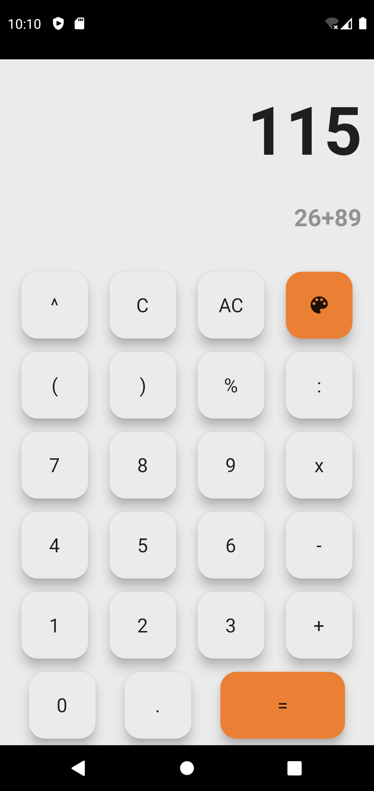
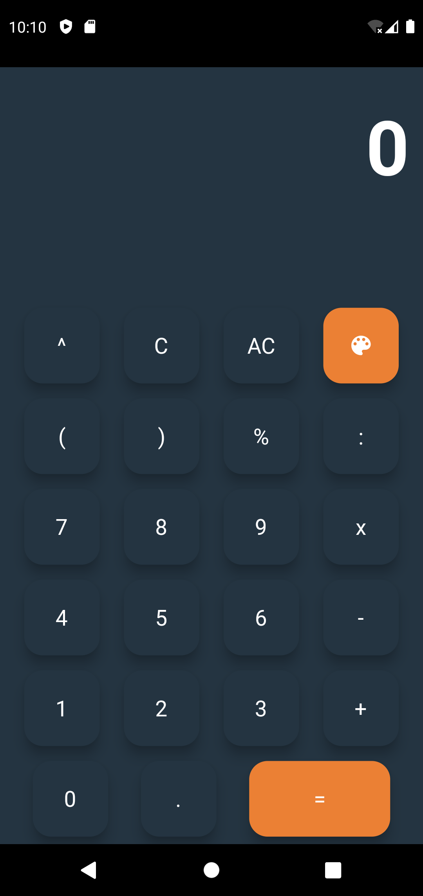
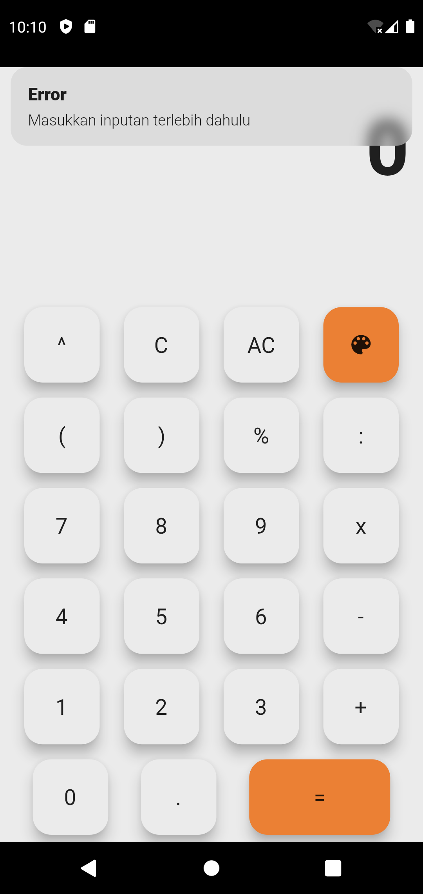

# Calculator App

### Description
Create simple calculator app using Flutter.

### Features
- Dark mode

### Package
- flutter_native_splash
- flutter_launcher_icons
- function_tree
- get

### Tech Used
 


## Screenshots

  |  | |


## How to Clone this Repository

Clone the project

```bash
  git clone https://github.com/handika231/calculator-app.git
```
